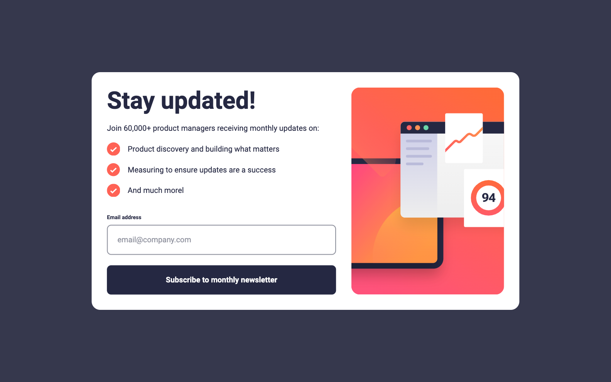
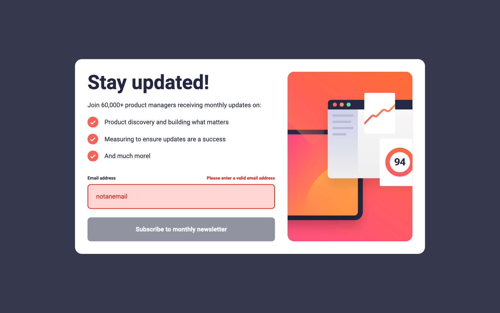
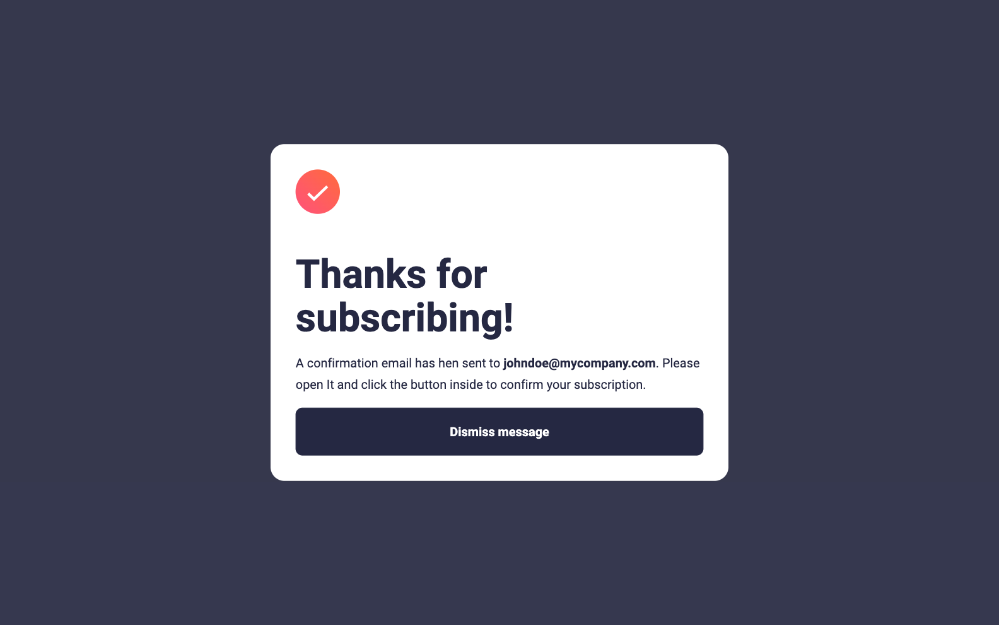
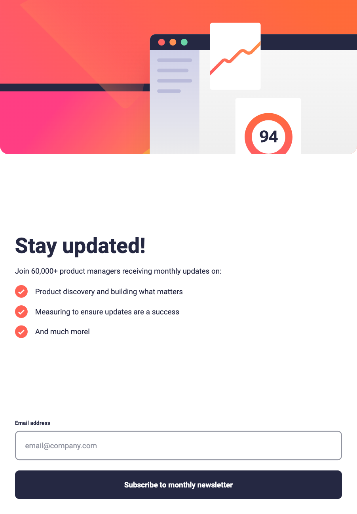
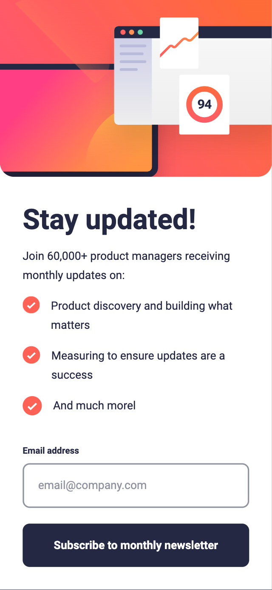
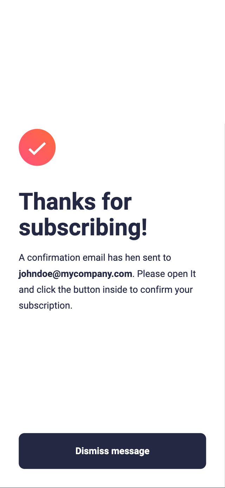

# Newsletter sign-up form with success message

**Subscription Form component built with React and housed within a Next.js 13 environment.**

The component is **self-contained** and handles **view rendering**, **input changes**, and **error handling** using the `useState` hook and the form's default `onSubmit` action. _There are no fancy gimmicks here, just straightforward, effective code._

The entirety of the component's code can be found under the [/components](./src/components/) directory. Although this component does depend on Next.js, **the form itself is otherwise pure React**.

The project also includes a **Next.js API Route**. While this server-side component doesn't perform any validation (as all validation is handled client-side), it serves as an illustrative example of how to send and receive data to and from a server.

As for **styling**, this project uses **custom SCSS**, all of which is component-specific and included directly within the component. The design approach is **fluid**, relying minimally on media queries and instead focusing on responsive sizing that works across all resolutions. The project also includes a reset file, one utility class (.flow), and a media query as a mixin as style dependencies.

The font for this project is imported via Next.js's implementation of Google Fonts, as well as importing the images via its Image component, which are the reasons why this project is **dependant of a Next.js environment**.

## Table of contents

- [Newsletter sign-up form with success message](#newsletter-sign-up-form-with-success-message)
  - [Table of contents](#table-of-contents)
  - [Overview](#overview)
    - [Screenshots](#screenshots)
    - [Links](#links)
  - [My process](#my-process)
    - [Built with](#built-with)
    - [Continued development](#continued-development)
  - [Author](#author)

## Overview

### Screenshots

### Links

- Live Site URL: [newsletter-sign-up-weld.vercel.app](https://newsletter-sign-up-weld.vercel.app)

## My process

### Built with

- React
- Next.js 13
- Typescript
- Custom SCSS code
- Fluid design (flexbox, grid, rem, clamp, best practices)
- All-in-one component
- API for sending data & receiving a real response

### Continued development

- Improve email validation (i.e min/max length)
- Add server validation
- Abstract the code more so it can be easily imported in a bigger project
- Allow customization through params/variables (i.e theming)

## Author

- Frontend Mentor - [@vladmee](https://www.frontendmentor.io/profile/vladmee)
